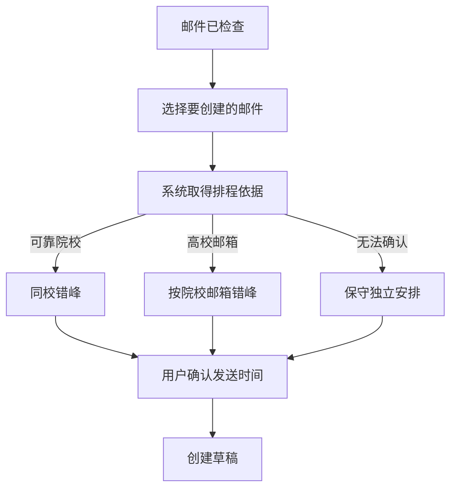

# v1.23 院校排程与选择面板重构

## 结论

院校不是草稿内容，也不是用户在“选择与安排”阶段需要逐封确认的主要信息。它的唯一直接职责是把同一院校的联系人放入同一个错峰组。

因此院校应当：

- 在后台自动取得和验证；
- 只影响自动排程；
- 缺失或不确定时安全降级；
- 不占据主表编辑列；
- 不因差异阻塞草稿创建。

## 截图暴露的问题

主表把院校显示为宽大的文本输入框，其中出现 `A / B / C`。这会产生三种误导：

1. 用户会认为院校是创建草稿前必须逐项修正的邮件内容。
2. 输入框的视觉权重高于主题和发送时间，破坏当前阶段的决策顺序。
3. 内部解析值直接暴露，系统把数据质量责任转嫁给用户。

旧排程在收件人使用高校邮箱时会优先按高校域名归组，所以这些错误值多数只污染标签显示；使用通用邮箱时，错误值则可能把同校联系人拆成不同组。

## 原因

导入层允许来源中的“学校 / 机构”字段直接进入任务。它只验证表头映射，没有验证每一行的值是否真的像院校名称。于是单字母批次或分类代码也可进入 `task.school`。

同时，选择表把 `task.school` 设计成可编辑业务字段，进一步放大了这个内部值的重要性。解析问题与信息架构问题叠加，形成截图中的结果。

## 新业务流程

用户只需要决定两件事：本次是否创建，以及何时创建。院校识别是系统完成这项决策的辅助过程。

## 院校证据优先级

1. 总名单提供且联系人匹配可靠的院校；
2. 邮件标题或明确字段中的完整院校名称；
3. 与高校邮箱域名一致的院校简称；
4. 高校邮箱域名本身；
5. 无可靠证据时按单个联系人保守安排。

以下值会直接排除：

- 单字母或纯数字：`A`、`B`、`C`、`1`；
- 批次：`第一批`、`Batch B`、`Round 2`；
- 分组或类别：`Group A`、`Tier 1`、`标签 C`。

## 新面板层级

主表固定为五列：

| 列 | 用户要回答的问题 |
|---|---|
| 选择 | 这封是否在本次创建？ |
| 收件人 | 草稿发给谁？ |
| 主题 | 这封邮件是什么？ |
| 发送时间 | 何时创建定时草稿？ |
| 结果 | 当前能否创建？ |

院校不再作为输入列。自动排程区域只用一句话解释其作用：院校用于避免同校联系过于集中；无法识别时系统会保守错峰，不影响邮件内容。

## 院校差异

总名单与导入来源的院校不一致时：

- 排程采用专门总名单中的院校；
- 不向邮件任务添加错误；
- 不进入“邮件内容待处理”；
- 只在名单差异的“排程参考”折叠项中保留记录。

真正涉及联系人身份的多候选仍需核对，因为这可能改变收件人；单纯院校差异不需要用户处理。

## 验证

`test-schedule-institution.js` 验证：

1. `A / B / C`、数字和批次值不能成为院校；
2. 与高校邮箱相符的简称可以用于排程；
3. 总名单提供的可靠简称可以使用；
4. 伪院校值不会进入排程标签；
5. 同一高校邮箱域名不会被 `A / B` 错误拆组；
6. 同校每轮一位时仍按七天间隔错峰。

`test-ui-contract.js` 同时验证主表只有五列、学校输入框已移除、院校用途说明存在。
