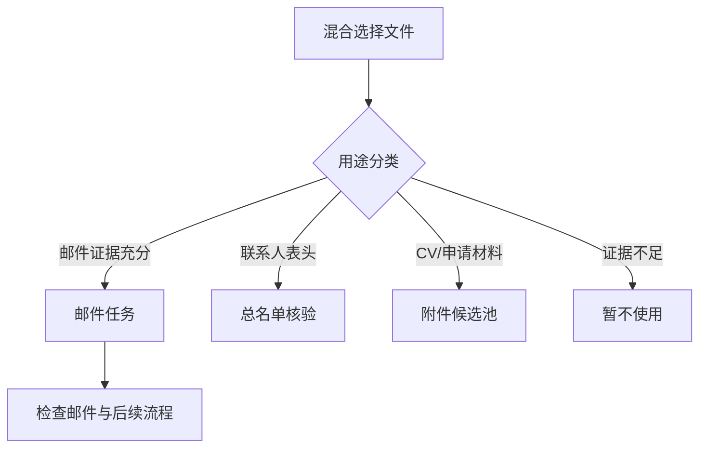

# v1.22 混合资料分流与业务流程升级

## 问题结论

旧流程把“适配器能够读取”误当成“内容就是邮件”。多文件上传后，所有标准化记录会一起参与字段推断，Word 的兜底结果还会把整篇普通文档包装成一条“正文”。因此 CV、名单、研究计划或会议记录虽然不是邮件，也可能进入邮件队列。

这不是单个关键词漏判，而是资料用途判断缺失：文件格式层、字段推断层和邮件任务层之间没有一道明确的业务路由。

## 会造成的业务阻碍

| 污染来源 | 旧系统可能的解释 | 对业务的影响 |
|---|---|---|
| 总名单表格 | 邮箱列→收件人，姓名/学校短文本→主题 | 生成大量伪邮件；任务数、完成率、批次统计失真 |
| CV / 简历 Word | “一文件一正文”邮件 | 出现缺收件人、缺主题阻塞；正文预览被简历占据 |
| PDF / 研究计划 | 不支持格式导致整批失败，或被遗漏 | 真邮件也无法继续，附件匹配池不完整 |
| 普通说明、会议记录 | 低置信度邮件 | 人工逐条排除；待检查队列膨胀 |
| CV 中的邮箱 | 候选收件人 | 可能与导师邮箱串线，带来错误草稿风险 |

污染还会向下游传递：阻止自动推进、干扰名单核验、扩大附件扫描、改变自动排程分组，并可能让用户在“看起来合理”的伪任务上误操作。

## 根因

1. `wordTaskRows` 只表示数据已被包装成统一行结构，不代表来源具有邮件语义。
2. 通用字段推断会根据数据形态猜测字段：邮箱数据像收件人，短文本像主题，长文本像正文；这对未知表格有用，但不能作为邮件用途证明。
3. 多 Word 文件在用途分类之前合并，导致文件级身份丢失，后续难以整体排除 CV 或名单。
4. 当没有任何来源自动启用时，旧流程强制开启评分最高的一组内容；这等于要求系统必须“猜出一封邮件”。
5. 错误直到逐封邮件检查阶段才暴露，用户只能清理伪任务，无法一次纠正整个来源的用途。

## 新流程

分流发生在记录集合合并和任务生成之前。下游只消费与自身职责一致的数据：

- 邮件任务层只读取 `purpose=mail`。
- 总名单层只读取 `purpose=roster`，用于补学校和联系人核验。
- 附件层只读取 `purpose=attachment`，仅在邮件明确引用附件时匹配，不自动全量附加。
- 暂不使用资料不进入任务，不产生阻塞；用户可在来源级调整用途。

混合批次中的单个来源如果无法读取，会被保留为“暂不使用”并显示错误原因，而不是让整个批次失败。只有单文件导入且该文件本身无法读取时，系统才直接报告读取失败。

## 判断证据

### 邮件

- 邮件识别器已定位称呼、主题、正文、结束语、署名等结构；或
- 来源表头明确同时包含“收件人 + 主题/正文”，或“主题 + 正文”。

只靠某列数据长得像邮箱或长文本，不足以证明整组内容是邮件。

### 总名单

- 表头至少包含姓名、邮箱、院校中的两类；
- 可带批次、状态、优先级、标签、备注；
- 不含明确的邮件主题和正文表头。

### 附件候选

- 文件名或内容明显属于 CV、Resume、成绩单、研究计划、个人陈述等申请材料；或
- PDF、PPT、图片等直接附件格式从主入口混合上传。

### 暂不使用

- 普通 Word 正文只有内容，没有可验证的邮件边界；
- 表格只有弱数据形态线索，无法可靠判定为邮件或名单。

## 无邮件停止态

如果分流后没有任何邮件来源，系统不会再启用“最像邮件”的内容，也不会进入选择、排程和草稿创建。界面显示“未找到可确认的邮件资料”，同时保留来源用途调整入口。

这不是业务阻塞，而是安全停止：非邮件资料已被妥善分流，但当前没有可执行的邮件任务。

## 人工调整原则

- 一次调整整组来源用途，不逐行排除伪邮件。
- 调为邮件后才开放字段对应和邮件检查。
- 调为总名单后立即重建名单索引并重新核验当前邮件。
- 调为附件候选后立即进入附件索引。
- 调为暂不使用后立即从所有下游业务中退出。

## 回归范围

`test-source-routing.js` 覆盖：

1. 真实邮件结构识别为邮件；
2. 明确邮件表头识别为邮件；
3. 导师姓名/院校/邮箱/批次表识别为总名单；
4. CV Word 识别为附件候选；
5. 普通 Word 不再自动成为邮件；
6. 多 Word 合并只合并邮件来源；
7. CSV 邮件与 PDF CV 混合上传各归其位；
8. 只上传 PDF 时安全停止，不制造邮件；
9. 内容层不存在强制启用“最佳猜测来源”的旧兜底。
10. 混合批次中单个不可读来源被隔离，其余邮件仍可生成任务。
